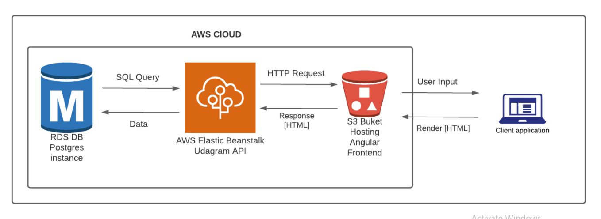
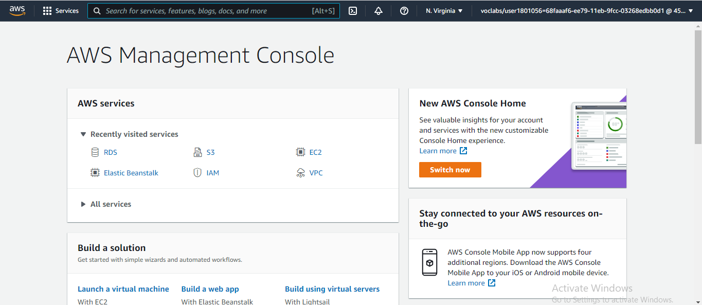
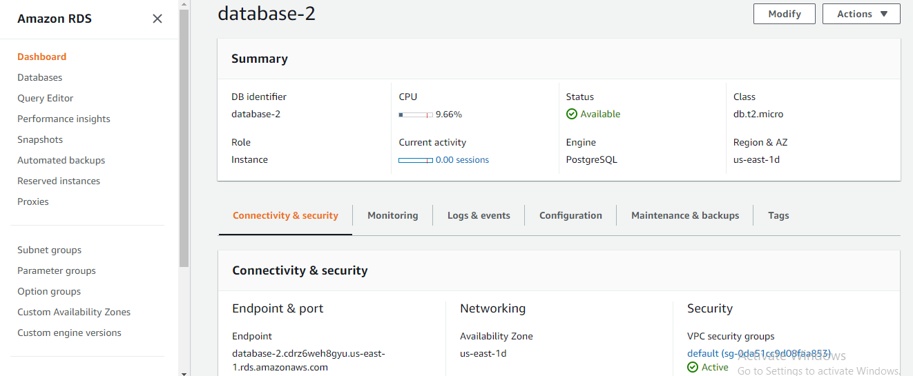
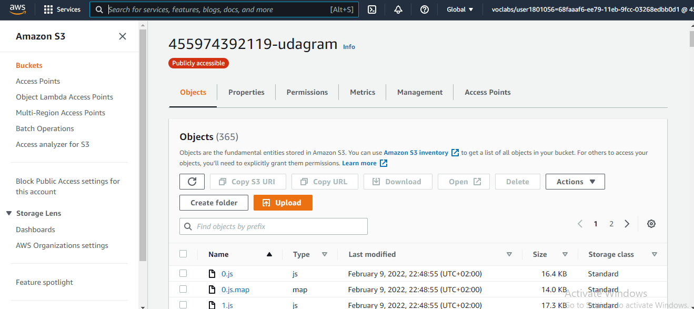
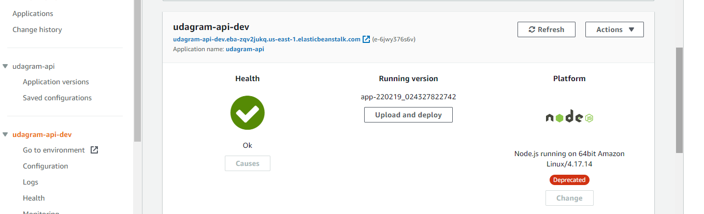
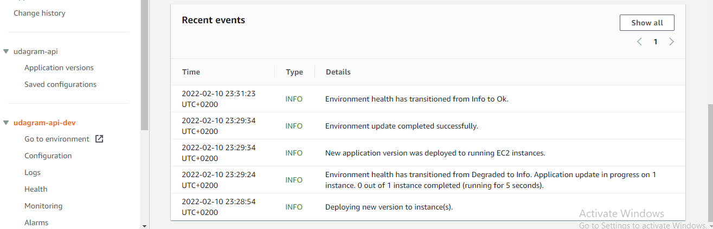

# Infrastructure diagram

   

## Udagram Architecture

### Provision the necessary AWS services needed for running the application:

   

1. In AWS, provision a publicly available RDS database running Postgres:

   

2. In AWS, provision a s3 bucket for hosting the uploaded files:

   

3. In AWS, provision a web server Elastic Beanstalk (EB):

   
   