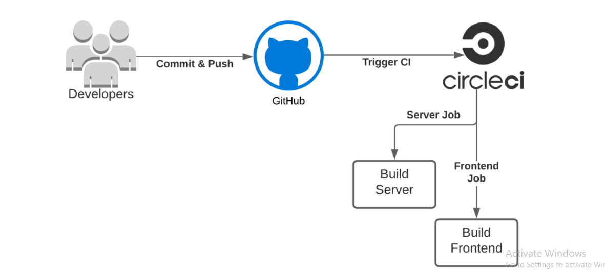
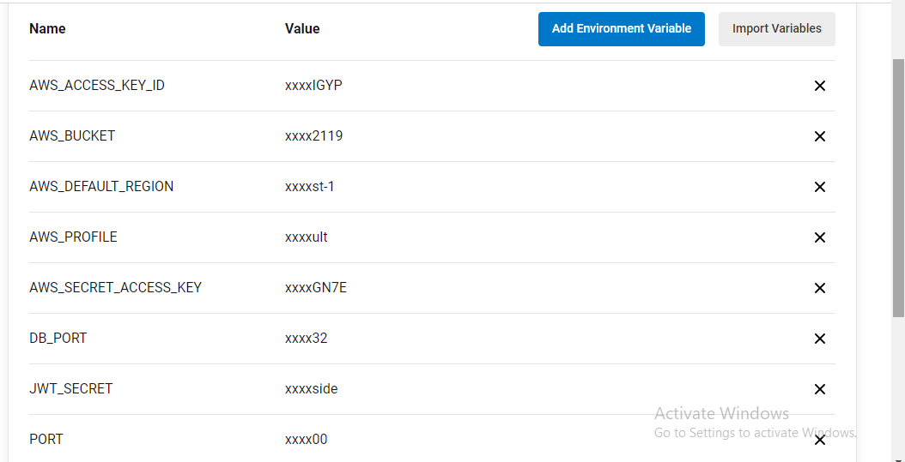
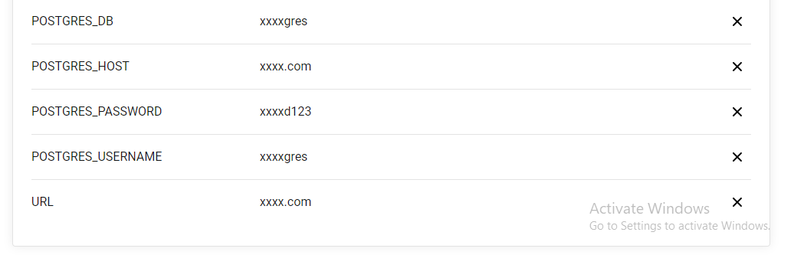
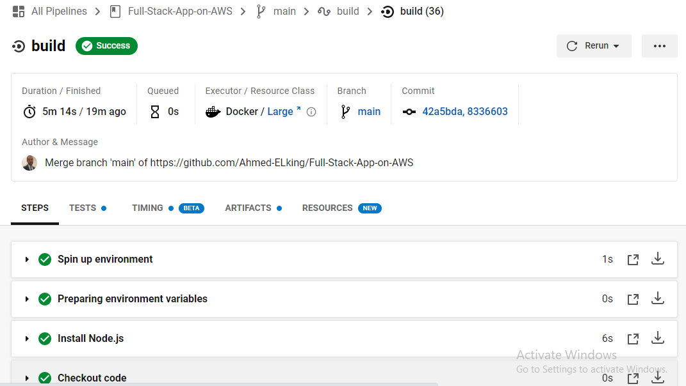
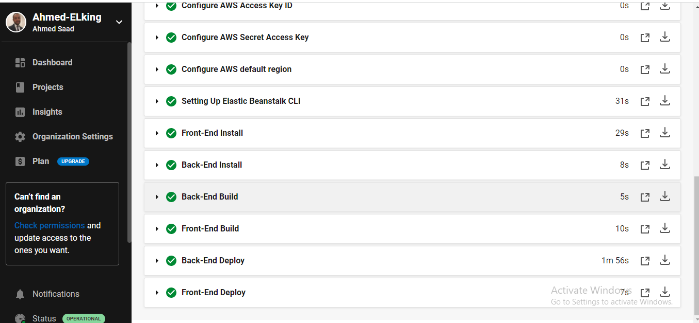

# Pipeline diagram

## Pipeline process

1. Circleci creates an environments with orbs:
   1. `node: circleci/node@5.0.0`
   2. `aws-cli: circleci/aws-cli@2.0.0`
   3. `eb: circleci/aws-elastic-beanstalk@2.0.1`

2. Setup aws-cli with circleci environment variables:

   
   

3. Installing NPM packages
4. Install frontend dependencies
5. Install backend dependencies
6. Build the frontend
7. Build the backend
8. Deploy the frontend
9. Deploy the backend

   
   
   