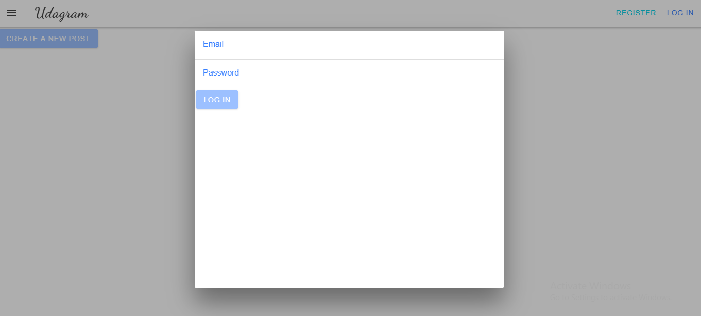

# Udagram

The udagram application is a fairly simple application that includes all the major components of a Full-Stack web application.

## Udagram URL 

- [URL](http://udagram-455974392119.s3-website-us-east-1.amazonaws.com)

   
## Getting Started

1. Clone this repo locally into the location of your choice.
1. Move the content of the udagram folder at the root of the repository as this will become the main content of the project.
1. Open a terminal and navigate to the root of the repo
1. follow the instructions in the installation step

### Installation

1. Create .env file:

```
POSTGRES_HOST=
DB_PORT=
POSTGRES_DB=
POSTGRES_PASSWORD=
POSTGRES_USERNAME=
PORT=
RDS DIALECT=
AWS_DEFAULT_REGION=
AWS_PROFILE=
AWS_BUCKET=
URL=
AWS_ACCESS_KEY_ID=
AWS_SECRET_ACCESS_KEY=
JWT_SECRET=

```

2. From the root of the repo, navigate udagram-api folder: 

```
cd udagram-api

``` 
to install the node_modules: 

```
npm install

``` 
After installation is done start the api in dev mode with: 

```
npm run dev

```
3. Without closing the terminal in step 1, navigate to the udagram-frontend: 

```
cd udagram-frontend

``` 
to install the node_modules: 

```
npm install

``` 
After installation is done start the api in dev mode with:

```
npm run start

```

4. You can concise all the above steps by running this two commands from the root directory:

to install the node_modules:

```
npm install

``` 
and to install all dependencies and build udagram-frontend and udagram-api:

```
npm run build:all

```

## Testing

This project contains two different test suite: unit tests and End-To-End tests(e2e). Follow these steps to run the tests.

```
cd udagram-frontend
 
```

```
npm run test

```

```
npm run e2e

```

There are no Unit test on the back-end

### Unit Tests:

Unit tests are using the Jasmine Framework.

### End to End Tests:

The e2e tests are using Protractor and Jasmine.

## Built With

- [Angular](https://angular.io/) - Single Page Application Framework
- [Node](https://nodejs.org) - Javascript Runtime
- [Express](https://expressjs.com/) - Javascript API Framework

## Dependencies

A list of project dependencies can be found [here.](Docs/dependencies.md)


## Udagram Infrastructure

Can be found [here.](Docs/Infrastructure.md)


## Pipeline process

Can be found [here.](Docs/Pipeline.md)
