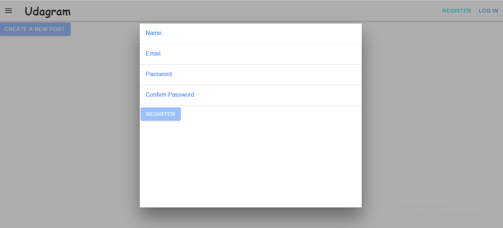
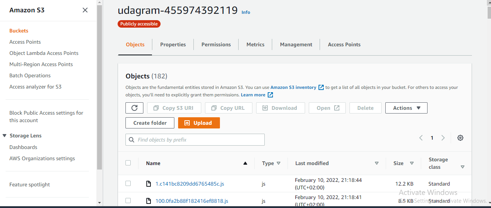
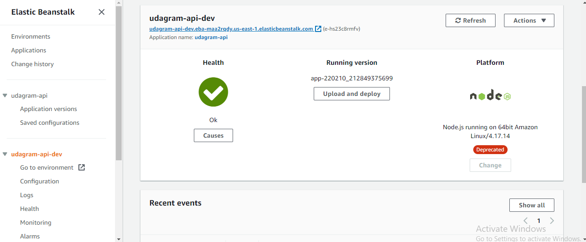
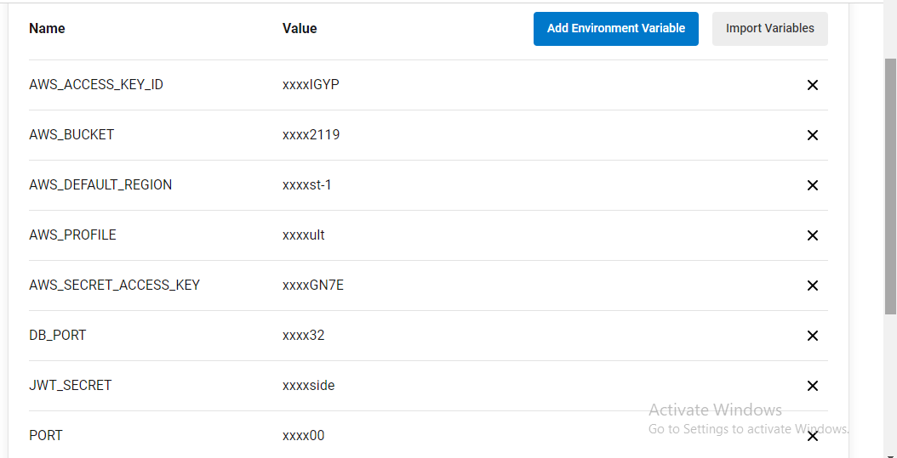
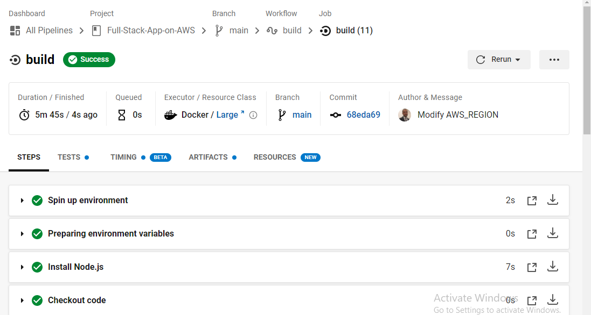
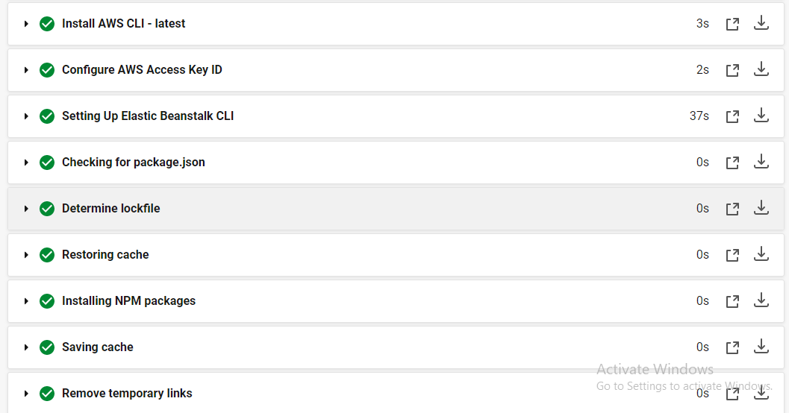

# Udagram

The udagram application is a fairly simple application that includes all the major components of a Full-Stack web application.

## Udagram URL 

- [URL](http://udagram-455974392119.s3-website-us-east-1.amazonaws.com)

   
## Getting Started

1. Clone this repo locally into the location of your choice.
1. Move the content of the udagram folder at the root of the repository as this will become the main content of the project.
1. Open a terminal and navigate to the root of the repo
1. follow the instructions in the installation step

### Dependencies

```
- Node v14.15.1 (LTS) or more recent. While older versions can work it is advisable to keep node to latest LTS version

- npm 6.14.8 (LTS) or more recent, Yarn can work but was not tested for this project

- AWS CLI v2, v1 can work but was not tested for this project

- A RDS database running Postgres.

- A S3 bucket for hosting uploaded pictures.

```

### Installation

1. From the root of the repo, navigate udagram-api folder `cd udagram-api` to install the node_modules `npm install`. After installation is done start the api in dev mode with `npm run dev`.
1. Without closing the terminal in step 1, navigate to the udagram-frontend `cd udagram-frontend` to intall the node_modules `npm install`. After installation is done start the api in dev mode with `npm run start`.
1. Create .env file:

```
POSTGRES_HOST=
DB_PORT=
POSTGRES_DB=
POSTGRES_PASSWORD=
POSTGRES_USERNAME=
PORT=
RDS DIALECT=
AWS_DEFAULT_REGION=
AWS_PROFILE=
AWS_BUCKET=
URL=
AWS_ACCESS_KEY_ID=
AWS_SECRET_ACCESS_KEY=
JWT_SECRET=

```

## Testing

This project contains two different test suite: unit tests and End-To-End tests(e2e). Follow these steps to run the tests.

1. `cd udagram-frontend`
1. `npm run test`
1. `npm run e2e`

There are no Unit test on the back-end

### Unit Tests:

Unit tests are using the Jasmine Framework.

### End to End Tests:

The e2e tests are using Protractor and Jasmine.

## Built With

- [Angular](https://angular.io/) - Single Page Application Framework
- [Node](https://nodejs.org) - Javascript Runtime
- [Express](https://expressjs.com/) - Javascript API Framework

## Infrastructure diagram

   

## Udagram Architecture

### Provision the necessary AWS services needed for running the application:


   

1. In AWS, provision a publicly available RDS database running Postgres:


   


2. In AWS, provision a s3 bucket for hosting the uploaded files:


   


3. In AWS, provision a web server Elastic Beanstalk (EB):


   
   

## Pipeline process

1. Circleci creates an environments with orbs:
   1. `node: circleci/node@5.0.0`
   2. `aws-cli: circleci/aws-cli@2.0.0`
   3. `eb: circleci/aws-elastic-beanstalk@2.0.1`

2. Setup aws-cli with circleci environment variables:


   
   


3. Installing NPM packages
4. Install frontend dependencies
5. Install backend dependencies
6. Build the frontend
7. Build the backend
8. Deploy the frontend
9. Deploy the backend


   

   
   
